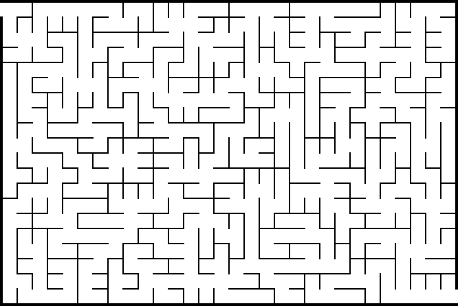

# Maze generator

Generates randomized mazes.

| Argument          | Value                    | Default    | Description                          |
| ----------------- | ------------------------ | ---------- | ------------------------------------ |
| `--help`/`-h`     | /                        | /          | Show the help message and exit       |
| `--size`/`-s`     | `W H`                    |            | The size of the maze in squares      |
| `--algoritm`/`-a` | `best`\|`breadth`\|`ust` | `ust`      | The generation algoritms to use      |
| `--border`        | `px`                     | `4`        | The outer border thickness in pixels |
| `--wall`          | `px`                     | `2`        | The inner wall thickness in pixels   |
| `--path`          | `px`                     | `20`       | The width of the pathway in pixels   |
| `--output`/`-o`   | `path`                   | `path.png` | The output file                      |
